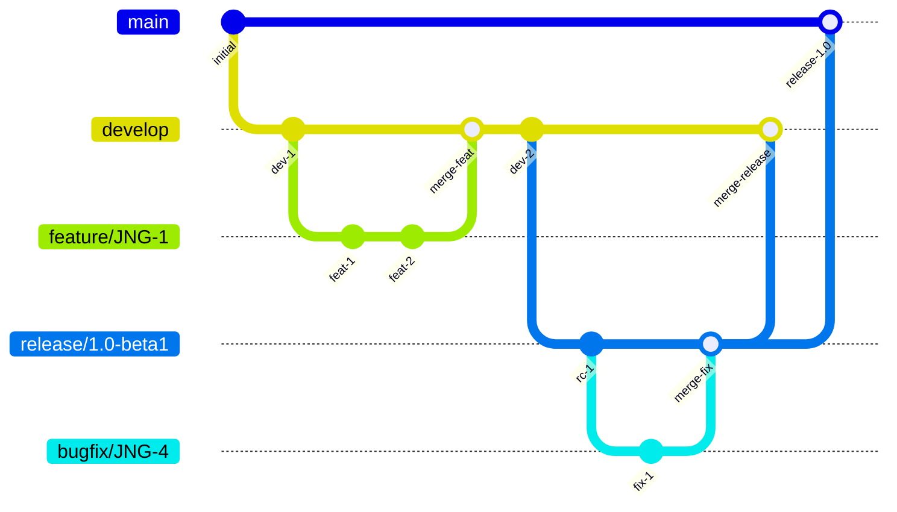
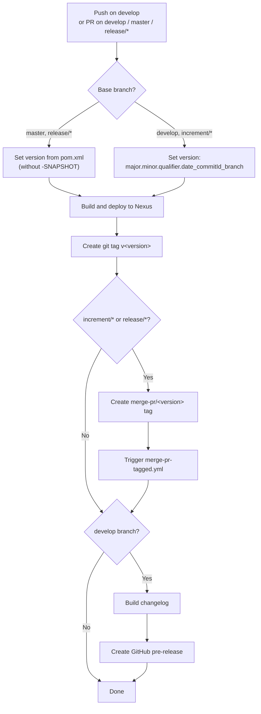
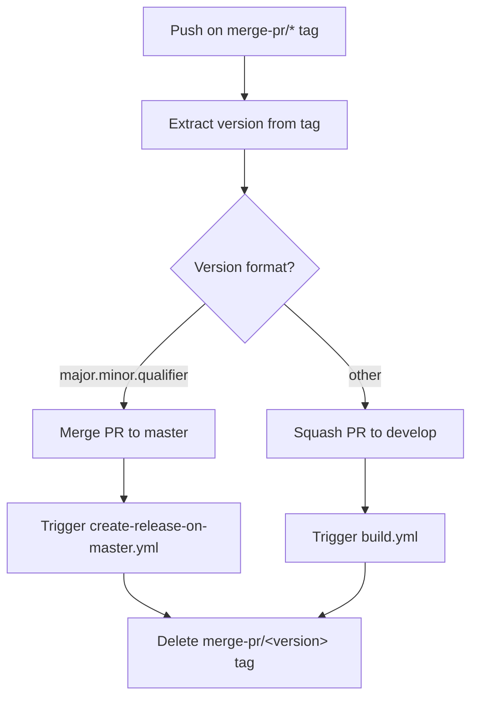
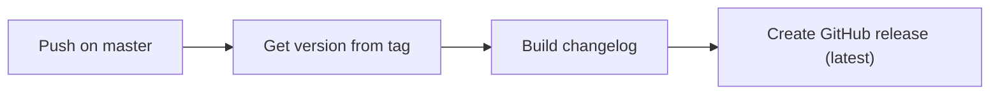
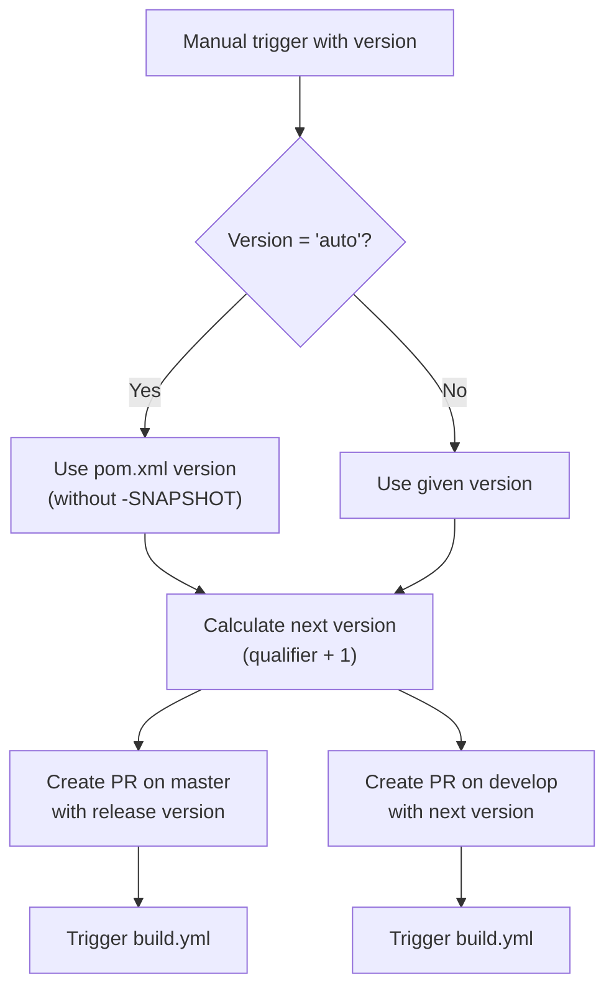

# CI/CD Flow — Development Version and Branch Handling

This document describes the branching strategy, version numbering, and GitHub Actions workflows used to build, test, and release the OSGi Email project.

## Branch Strategy

The project follows a [GitFlow](https://www.atlassian.com/git/tutorials/comparing-workflows/gitflow-workflow) branching model. Every branch type has a specific role in the development lifecycle.

| Branch Pattern | Base | Purpose |
|---------------|------|---------|
| `develop` | — | Main development branch; contains the latest development sources |
| `feature/JNG-<N>_
` | `develop` | New features for the next release |
| `release/<version>` | `develop` | Stabilization branches for a specific release (e.g., `release/1.0-beta1`) |
| `bugfix/JNG-<N>_
` | `release/*` | Bug fixes applied during release stabilization |
| `support/JNG-<N>_
` | `release/*` | Minor enhancements for a previous release |
| `hotfix/JNG-<N>_
` | `master` | Emergency fixes applied to both `master` and `develop` |
| `master` | — | Latest released production-ready code |

## Version Numbers

Versions follow [semantic versioning](https://semver.org/) with these rules:

| Event | Version Change |
|-------|---------------|
| Starting a `feature/` branch | No change |
| Starting a `release/` branch from `develop` | 2nd number (minor) is incremented on `develop` |
| `bugfix/` branches on `release/*` | No change — fixes are applied before the release is finalized |
| Starting a `support/` branch | 3rd number (patch) is incremented |
| Starting a `hotfix/` branch | 4th number (hotfix) is incremented |

## GitHub Actions Workflows

The CI/CD pipeline is composed of several interconnected workflows. Each workflow triggers downstream workflows via tags or branch events.

### build.yml — Main Build Pipeline

This is the primary workflow, triggered by pushes to `develop` and pull requests targeting `develop`, `master`, `increment/*`, or `release/*`.

### merge-pr-tagged.yml — Pull Request Merger

Triggered when a `merge-pr/*` tag is pushed. Determines whether to merge to `master` (for release-quality versions) or squash back to `develop`.

### create-release-on-master.yml — Release Publisher

Triggered by pushes to `master`. Creates the final GitHub release with a changelog.

### release.yml — Release Initiator

Manually triggered with a version parameter (or `auto` to use the POM version). Creates two pull requests — one for `master` with the release version and one for `develop` with the bumped next version.

## Development Rules

> **Important:** There is no commit without a ticket number. Every pull request and commit message must reference a JIRA ticket in the format `JNG-xxx`.

Issue tracking is managed in [JIRA](https://blackbelt.atlassian.net/jira/dashboards).
