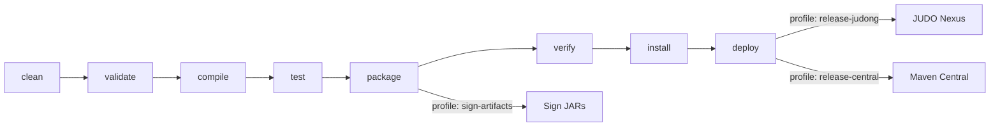

# Contributing to OSGi Email

## Development Environment

### Required Tools

| Tool | Version | Notes |
|------|---------|-------|
| **JDK** | 21 | [Zulu JDK](https://www.azul.com/downloads/?version=java-21-lts&package=jdk) recommended |
| **Maven** | 3.9+ | [Download](https://maven.apache.org/download.cgi) — or use the included `./mvnw` wrapper |

### Verify Your Setup

```bash
# Should show JDK 21
java -version

# Should show Maven 3.9+
mvn -version
```

## Build Lifecycle

The project uses a standard Maven multi-module build. All four modules are included by default via the `modules` profile.



### Common Commands

```bash
# Full build
mvn clean install

# Tests only
mvn clean test

# Integration tests only
mvn test -pl osgi-email-itest

# Single test class
mvn test -pl osgi-email-itest -Dtest=EmailITest

# Skip submodules (parent POM only)
mvn clean install -DskipModules=true
```

## Code Structure

The project follows a standard Maven multi-module layout with four submodules:

```
osgi-email-parent/
├── osgi-email-api/          # Service interface and DTOs
├── osgi-email-impl/         # Spring Mail + Handlebars implementation
├── osgi-email-karaf-features/  # Karaf feature descriptor
└── osgi-email-itest/        # Pax Exam integration tests
```

Each `bundle`-packaged module produces an OSGi bundle JAR. The `feature`-packaged module produces a Karaf features XML. The `itest` module runs tests inside a real Karaf container using Pax Exam.

> **Note:** The integration tests use **JUnit 4** (required by Pax Exam), not JUnit 5. Unit tests in other modules use JUnit 5 (Jupiter).

## Submission Guidelines

### Submitting an Issue

Before filing a new issue, search the [issue tracker](https://github.com/BlackBeltTechnology/osgi-email/issues) — the problem may already be reported or resolved.

When filing a bug report, include:

- Output of `java -version` and `mvn -version`
- Relevant `pom.xml` or `.flattened-pom.xml` snippets
- A minimal reproducible use case

A clear reproduction helps maintainers triage and fix issues much faster.

[File a new issue](https://github.com/BlackBeltTechnology/osgi-email/issues/new/choose)

### Submitting a Pull Request

This project follows [GitHub's standard forking model](https://guides.github.com/activities/forking/). Fork the repository, create a branch, and submit a pull request.

For details on how the CI/CD pipeline processes pull requests, see the [CI Flow documentation](.github/CIFLOW.md).
