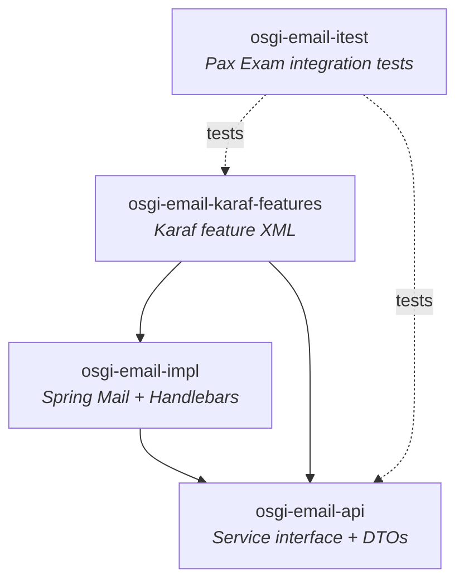
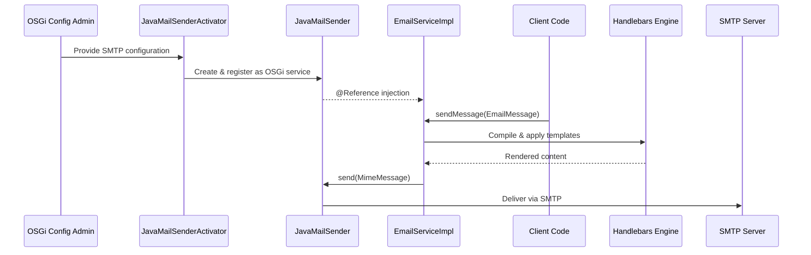
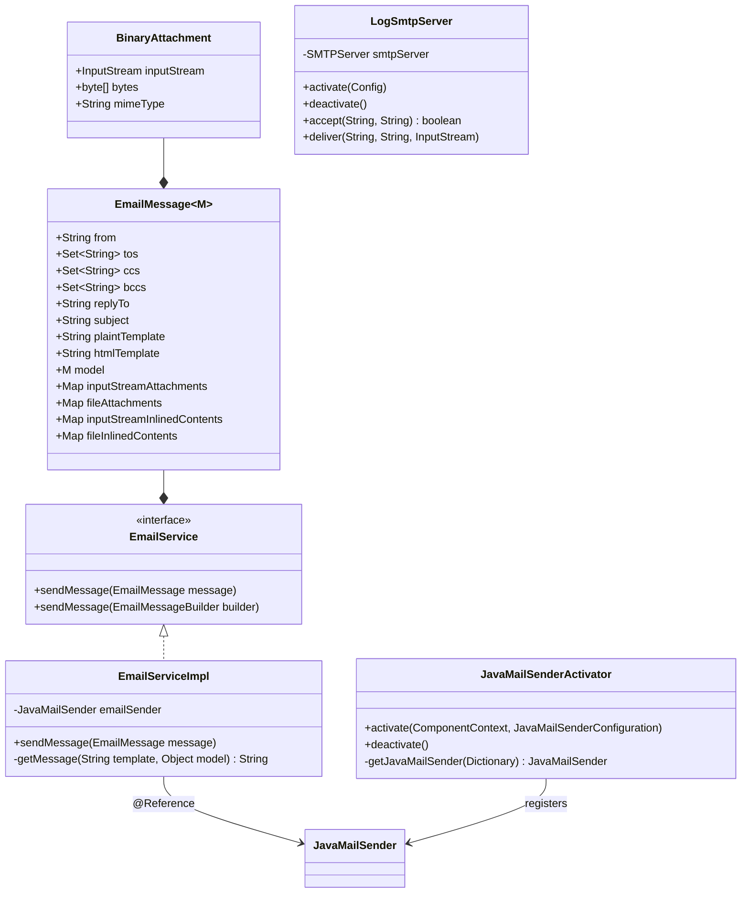
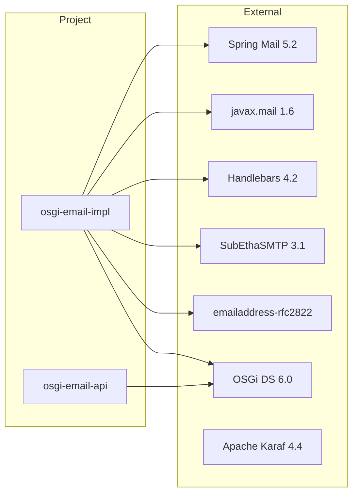

# OSGi Email Service

[](https://github.com/BlackBeltTechnology/osgi-email/actions/workflows/build.yml)

## Overview

An OSGi-based email service for Apache Karaf that provides a clean API for sending templated emails. The service supports Handlebars templates (both plain text and HTML), file and stream-based attachments, inline content (CID-referenced images), and full SMTP configuration via OSGi Configuration Admin.

## Architecture

The project is organized into four Maven modules that form a layered architecture — a pure API, an implementation backed by Spring Mail, a Karaf feature descriptor for deployment, and an integration test suite that spins up a real Karaf container.



### Module Details

| Module | Packaging | Purpose |
|--------|-----------|---------|
| `osgi-email-api` | `bundle` | Defines `EmailService` interface, `EmailMessage` and `BinaryAttachment` builder DTOs. No external dependencies. |
| `osgi-email-impl` | `bundle` | Implements `EmailService` using Spring's `JavaMailSender` and Handlebars templating. Includes `JavaMailSenderActivator` (config-driven OSGi component) and `LogSmtpServer` (embedded test SMTP). |
| `osgi-email-karaf-features` | `feature` | Karaf feature descriptor that bundles all required JARs and declares feature dependencies (spring, guava, subethamail, scr). |
| `osgi-email-itest` | `jar` | Integration tests using Pax Exam with JUnit 4, running inside a real Karaf container with an embedded SubEthaSMTP server. |

### Component Interaction

The OSGi runtime wires components together through Declarative Services. Configuration is provided via OSGi Config Admin, and services are discovered and injected automatically.



### Class Structure



### Key Dependencies



## Quick Start

### Requirements

- **JDK 21** (Zulu recommended)
- **Maven 3.9+**

### Build Commands

```bash
# Full build with all tests
mvn clean install

# Run only unit tests
mvn clean test

# Run integration tests (Pax Exam / Karaf container)
mvn test -pl osgi-email-itest

# Run a specific test class
mvn test -pl osgi-email-itest -Dtest=EmailITest

# Skip all submodules (parent only)
mvn clean install -DskipModules=true
```

### Maven Profiles

| Profile | Purpose |
|---------|---------|
| `modules` | Default — includes all four submodules |
| `sign-artifacts` | GPG-sign artifacts for release |
| `release-judong` | Deploy snapshots to JUDO Nexus |
| `release-central` | Deploy releases to Maven Central (Sonatype OSSRH) |
| `generate-github-asciidoc-diagrams` | Generate HTML from AsciiDoc with PlantUML diagrams |
| `update-source-code-license` | Update Apache 2.0 license headers in source files |

### Sending an Email (API Example)

```java
emailService.sendMessage(
    EmailService.EmailMessage.emailBuilder()
        .from("sender@example.com")
        .tos(Set.of("recipient@example.com"))
        .subject("Hello")
        .plaintTemplate("Hi {{name}}, welcome!")
        .htmlTemplate("<h1>Hi {{name}}</h1><p>Welcome!</p>")
        .model(Map.of("name", "World"))
        .build()
);
```

### OSGi Configuration

Deploy the Karaf feature and provide SMTP configuration via Config Admin:

**`etc/hu.blackbelt.email.impl.JavaMailSenderActivator.cfg`**
```properties
mail.smtp.host=smtp.example.com
mail.smtp.port=587
mail.smtp.user=user@example.com
mail.smtp.password=secret
mail.smtp.auth=true
mail.smtp.starttls.enable=true
```

## Contributing

Everyone is welcome to contribute. Please read the [Contributing Guide](CONTRIBUTING.md) and the [CI Flow documentation](.github/CIFLOW.md) for details on the development workflow.

## License

This project is licensed under the [Apache License 2.0](http://www.apache.org/licenses/LICENSE-2.0).
